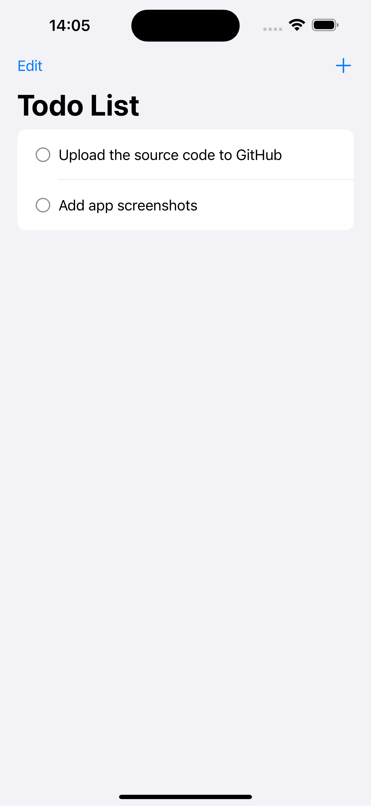
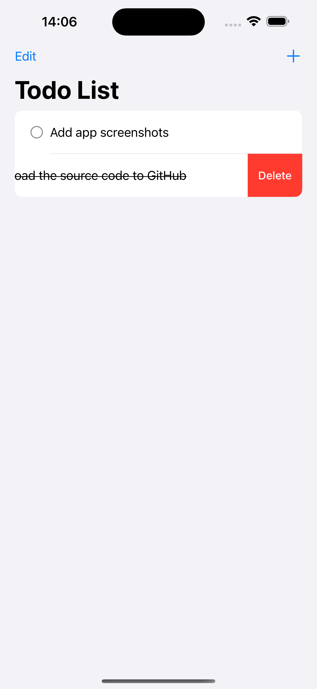
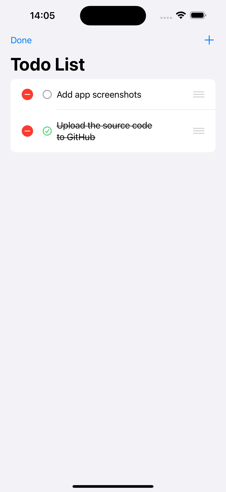
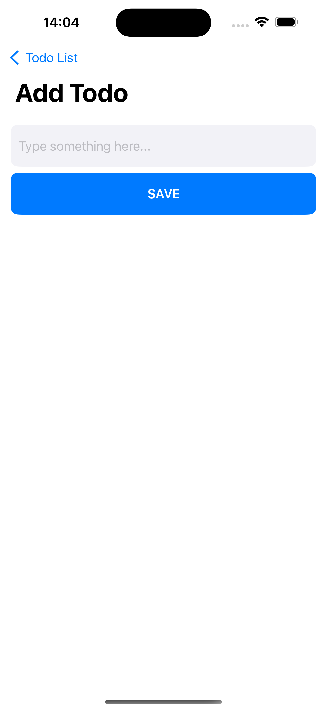

# SwiftUI TodoList App


## Overview

This is a simple iOS TodoList app developed using SwiftUI and following the MVVM (Model-View-ViewModel) architecture. The app allows users to create, check, and delete todo items, with data persistently stored locally.

## Features

- **MVVM Architecture:** Utilizes the MVVM design pattern for better separation of concerns.
- **Local Storage:** Persists todo items locally using Swift's UserDefaults or CoreData.
- **Animations:** Incorporates smooth animations for a polished user experience.
- **Navigation:** Implements navigation to seamlessly move between different screens.

## Screenshots

<!-- All Screenshots in the Same Row -->
<div style="display:flex; justify-content:space-between;">

  <!-- Screenshot 1 -->
  <div>
    
    <p align="left"><em>Todo List View</em></p>
  </div>

  <!-- Screenshot 2 -->
  <div>
    
    <p align="left"><em>Swipe to Delete</em></p>
  </div>
  
</div>
<!-- End of All Screenshots in the Same Row -->

<!-- All Screenshots in the Same Row -->
<div style="display:flex; justify-content:space-between;">
  <!-- Screenshot 3 -->
  <div>
    
    <p align="left"><em>Edit Mode</em></p>
  </div>

  <!-- Screenshot 4 -->
  <div>
    
    <p align="left"><em>Add New Todo Item</em></p>
  </div>

</div>
<!-- End of All Screenshots in the Same Row -->

## Video Demo

<video width="20%" height="auto" autoplay loop muted playsinline>
  <source src="./ScreenShots/1.mp4" type="video/mp4" alt="./ScreenShots/0.png">
  Your browser does not support the video tag.
</video>

_The video above demonstrates the animations in the todo list view._

## Getting Started

### Prerequisites

- Xcode 15.0 or later
- Swift 5.9 or later

### Installation

1. Clone the repository:

```bash
git clone https://github.com/decodevM/TodoList.git
```
